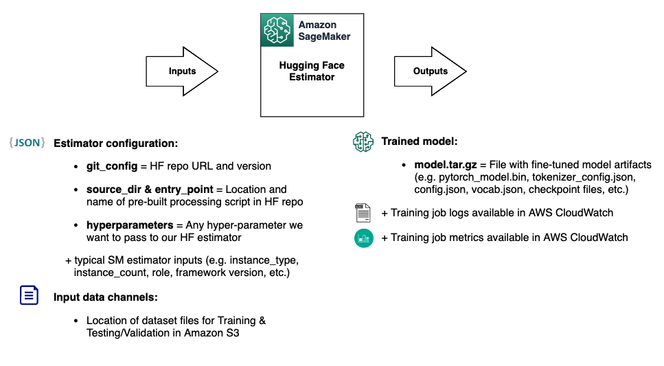

# huggingface-multi-label-text-classification
How 

In this [example notebook](./hf-sagmaker-multi-label-text-classifier.ipynb), we explore how to create a multi-label text classifer, by fine-tuning and deploying SOTA models with Amazon SageMaker, the Hugging Face container, and the Amazon SageMaker Python SDK.

We also rely on the library of pre-trained [models available in Hugging Face] (https://huggingface.co/models). We will demonstrate how you can bring your own content moderation data to fine tune the models, and use the processing scripts available in the Hugging Face hub for speeding up the process on tasks such as tokenization and data loading. Finally, we will deploy the model to an Amazon SageMaker endpoint and perform real-time inferences with sample phrases on our text classification use case.

In this example, the Amazon SageMaker Estimator is pointing directly towards the entry point script “run_glue.py” located in the Hugging Face repository in GitHub, i.e., there is no need to copy this script manually to our environment. You can rely on this script for bringing any custom data in CSV or JSON format for your text classification tasks, as long as it includes the classification label and text fields. Note that you have other equivalent scripts also available in the Transformers repository for other text processing tasks, such as: summarization, text-generation, etc. In our content moderation example, this script together with the Amazon SageMaker and HuggingFace integration will automatically:

* Pre-process our input data, e.g., encoding text labels
* Perform the relevant tokenization in the text automatically
* Prepare the data for training our BERT model for text classification using multiple labels you define

This represents a huge improvement in development time saving, and an operational efficiency increase compared to developing and performing these tasks manually in an equivalent PyTorch implementation. Note: you can explore over 15K [datasets](https://huggingface.co/datasets) within the Hugging Face hub and filter down by tasks to search for alternatives that amy suit your experimentation. 

We are providing the configuration and data channels as inputs for our estimator, and it will provide us the trained model with its logs and metrics as outputs.

Finally, Amazon SageMaker provides purpose-built tools for machine learning operations (MLOps) to help you automate and standardize processes across the ML lifecycle. Using [SageMaker MLOps tools](https://aws.amazon.com/sagemaker/mlops/?sagemaker-data-wrangler-whats-new.sort-by=item.additionalFields.postDateTime&sagemaker-data-wrangler-whats-new.sort-order=desc), you can easily train, test, troubleshoot, deploy, and govern ML models at scale to boost productivity of data scientists and ML engineers while maintaining model performance in production.

